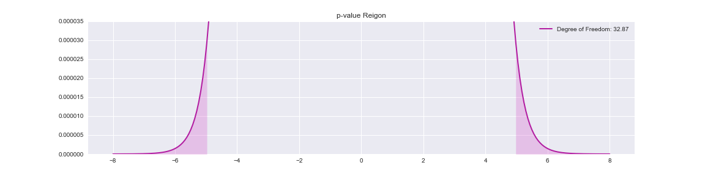

## Background
I started with data gathered by reddit user u/timtlm and the owner of [Splat Meta](https://www.splatmeta.ink). He has openly released this data and it is free to use.

Here is how he got the data:
* Data is gathered from SplatNet API accessible via the mobile app.
* Every two hours Nintendo updates the top 100 League Teams and Pairs.
* Data is retrieved from the API every 2 hours to get all weapon usages.
* Every week a new table is created summarizing the weapon usage for the previous week.

I chose to use this data because the API is designed to be accessed from a mobile app and is finicky to access from a computer. In addition, it would be impossible to get timeseries data since I do not have the time to gather data from the API for weeks. These weekly summaries are much more limited than raw data, but as a tradeoff it allows me to work with a much larger timeframe from the past.

## Process
1. Get the filenames of my CSVs in a chronologically sorted list.
    * Use bash in jupyter to list contents of data folder.
    * Sort filenames numerically to order by date.
2. Read each CSV and extract the data I am interested in, "Weapon Name" and "Usage Proportion".
    * Designed splatoon_csv function to do this.
        * Reads CSV, skipping extra header rows
        * Looks for designated collumns, which are sometimes named differently
        * Calculates "Usage Proportion"
        * Returns a 2 collumn dataframe
3. Join the data together on "Weapon Name".
    * Designed splatoon_join to do this.
        * Loops through list of filenames
        * Passes filenames to splatoon_csv to get dataframes
        * Stores first result and outer joins subsequent results to the first
        * Returns a dataframe indexed by "Weapon Name" with a usage collumn for each week
4. Save result as a CSV on local machine.
    * Plan to use database in future for scalability.
---

# Exploratory Data Analysis

## Initial Visualization
I load the data from my pipeline and decide to put it all in a spaghetti plot as a simple visualization.

#### Observations:
* This plot is next to useless, and not quite worth the effort to make it actually readable.
* The black line represents the mean of all weapons and there is a steady decline due to more weapons being added in the game leading to a lower average usage proportion.
* The highest few lines really stand out and have some interesting peaks and valleys. It would be good to look at a smaller subset.

## A better spaghetti
I decide to took at only the most used weapons according to multiple criteria.
* Usage in final week: this weapon was popular towards the end when the meta became more stable.
* Average usage: this weapon was popular throughout.
* Peak usage: this weapon was extremely popular at one point.

#### Observations:
* There were a quite a few weapons that showed up in all 3 plots, meaning that they were definitely used often, and a meta is fundamentally based on usage.
* The peaks and highest fluctuations happen early, before 15 weeks, while towards the end all the usage seems to converge. Metas are usually most unstable early in a game's lifetime and tend to stabilize as players figure out the best strategies.

## Further investigation of Top Weapons
I want to look at the weapons that showed up in all 3 top 10 lists and try to uncover the reasons for their high usage.
- Splattershot
- Splat Roller
- N-ZAP '85
- Tentatek Splattershot
- Forge Splattershot Pro
- Enperry Splat Dualies
- Blaster

There are a lot of shooter (rifle) class weapons in this list, 4 out of 7. There are 1 each of roller (melee), dualies (dual pistols), and blaster (explosive). My personal favorite from this list are the Enperry Splat Dualies.

### Spaghetti Plot:

#### Observations:
* Two weapons that caught my attention are the Splattershot and Tentatek Splattershot. These are variant weapons, where they have an identical main (gun) but a different sub (grenade) and special. The Splattershot starts as the most used weapon but is eventually overtaken by the Tentatek. I think this is due to patches buffing (increasing the power of) the Tentatek's Inkjet special but I cannot test that with current data.
* At a glance, the N-ZAP '85 appears to be the most consistently popular weapon. It is quite infamous in the game for being 'overused', especially in high-level team play where this data is from. I would like to analyze if it was truly overused.

### Heatmap:

These are the strongest correlations accompanied by my best guess as to why based on game knowledge.

Positive Correlations

+ N-ZAP '85 and Splat Roller
    * Not sure, may be coincidence since both were considered very good weapons initially but Splashdown was eventually discovered to be one of the weakest specials.
+ N-ZAP '85 and Forge Splattershot Pro
    * These two compliment each other as the N-ZAP is a close range Shooter while the Forge is a long range Shooter.

Negative Correlations

- Enperry Splat Dualies and Splattershot
    * These two compete with each other as they fill a very similar role of fast, close range weapons.
- Enperry Splat Dualies and Splat Roller
    * Based on the increasing trend of the Dualies compared to the decrease of the Roller I would guess that the maneuverability of Dualies allows them to counter the low range of Rollers.

I am not at a point where I can do much with correlations, so I will keep them in mind and move on.

## Testing The N-ZAP '85

The N-ZAP was (and still is) extremely prevalent, at one point it was pretty much expected you would see one every game.

The two main reasons that the community thought the N-ZAP was powerful at the time were:
* It is a Shooter (rifle) class main weapon, which is considered the most versatile of the main weapon types.
* It has the Ink Armor special, which was considered almost mandatory in high-level team play due to its power in team fights.

The three things I want to test are:
1. How often does it show up in a game assuming each player chooses their weapon independently. This is definitely a false assumption but it will give a rough idea of its prevalence.
2. Is it the most used shooter overall?
3. Is it the Ink Armor weapon of choice by a significant margin?

### Modeling N-ZAP Usage
I would like to see the probability of encountering N-ZAPs in matches since at one point the Splatoon community believed that they were in most, if not all matches. Matches in splatoon are teams of 4 vs 4, for a total of 8 players. Assuming each player choses their weapon independently (a likely incorrect assumption), N-ZAP usage can be modeled by a binomial distribution with:

I will first look at the N-ZAP when it was most popular, and likely when players clamoring over its overuse was most egregious.

#### Observations:
* There was a 73% chance to see at least one N-ZAP in every game in this time period. This does line up with the community opinion of the N-ZAP being overused. While it is not quite 100%, the phrase "every game" can be expected to be used in hyperbole, and I would certainly classify almost 3 out of 4 as "most" games.

However this peak usage was only for one week and the N-ZAPs usage was quite varied along the entire timeframe, so I would like to calculate the average probability as well.

53% is definitely a lower percent than what the community led me to believe at the time. I would not say that slightly over half qualifies for the intention of "most games", semantically maybe. It is still a very high percent considering the game has over 80 weapons to chose from, but that is nowhere near the perception that it is in every game.

For fun, I will calculate the probability of seeing any given weapon showing up in a game if every weapon was used equally.

This results in a probability of 0.108

At just under 11% there is not any point to test N-ZAP usage to hypothetical evenly distributed usage. It clearly shows up way more than than it should in terms of game balance.

### Versus Other Shooters
Since the top weapons list was packed with shooters (rifles), I will compare the usages of the N-ZAP '85 to the the other shooters that made it into the top weapons list.
* Splattershot
* Tentatek Splattershot
* Forge Splattershot Pro
* Enperry Splat Dualies*

*I also include the Enperry Splat Dualies since it overlaps quite a bit with the N-ZAP in role and playstyle and is more similar to it than the Forge Splattershot Pro.

It looks like the usage of the N-ZAP is the highest and well above the mean.

The splattershot is interesting in that it started as the most used weapon then started dropping quickly while the N-ZAP climbed rapidly. The splattershot was the best weapon in the first game so many players must have stuck to it until the merits of the N-ZAP were discovered and people started switching over.

As I expected, the N-ZAP's correlations are mostly neutral or negative except for the Forge Splattershot Pro (my thoughts on that above). Since these shooters all have a similar playstyle and fulfill the same role.

### Formal Hypothesis Testing

#### State a Scientific Question
> Is the N-ZAP '85 used more on average than the Splattershot?

#### State Null Hypothesis
> The N-ZAP '85 is used, at most, equally as the Splattershot.

#### State the Alternate Hypothesis
> The N-ZAP '85 is used more than the Splattershot.

#### In Mathematical Terms

#### Decide Rejection Threshold
> Standard alpha = 0.05

#### Calculate p-value
> Performed a Mann-Whitney U test
> p-value = 0.064

#### Compare p-value
> 0.064 > 0.05
>
> Therefore, Fail to Reject Null Hypothesis

#### Publish Data and Code Online With Explicit Instructions for Replicating Result.
> This document is already on [github](https://github.com/Rokushou/Splatoon2_Meta_EDA).

#### Conclusion
> Due to failure of rejecting the null hypothesis I cannot say that the N-ZAP '85 was used more than the Splattershot on average. This is surprising since the plot showed that the N-ZAP had higher usage than the Splattershot for the majority of the time period. This result demonstrates the importance of hypothesis testing and how looking at the data directly (or through a visualization) is not sufficient.

### Back to Shooters
Now I want to look at the other comparisons of all the other weapon pairs without going through formal hypothesis testing. I will keep alpha = 0.05 but use a function (mannwhitney.py in src folder) to get all p values at once.

p-value for:
- N-ZAP '85 > Splattershot: 0.064
- N-ZAP '85 > Tentatek Splattershot: 0.000
- N-ZAP '85 > Forge Splattershot Pro: 0.000
- N-ZAP '85 > Enperry Splat Dualies: 0.000
- Splattershot > Tentatek Splattershot: 0.000
- Splattershot > Forge Splattershot Pro: 0.000
- Splattershot > Enperry Splat Dualies: 0.000
- Tentatek Splattershot > Forge Splattershot Pro: 0.012
- Tentatek Splattershot > Enperry Splat Dualies: 0.022
- Enperry Splat Dualies > Forge Splattershot Pro: 0.489

#### Observations:
* The N-ZAP and Splattershot are clearly more used than everything else, with p-values close to 0.
* The Tentatek Splattershot is the 3rd most used weapon beating out the others with p < 0.05.
* The Enperry Splat Dualies and Forge Splattershot Pro usages are not very different, with a p-value of 0.5.

### Ink Armor Analysis

Ink Armor is a very powerful ability in high-level play since it benefits the whole team and can only be fully utilized by good teamwork. As a result, teams usually want 1 Ink Armor weapon as having multiple does not scale well. Therefore the N-ZAP being overused should mean lower usage of other Ink Armor weapons.

#### Observations:
* It looks like the N-ZAP '85 has more usage than all other ink armor weapons combined. I personally saw a lot of Tri-Sloshers, but looks like they are not as prevalent in high-level play.

The tri-Slosher, a bucket used to splash paint. Truly a sophisticated and high-tech weapon.

#### Observations:
* These correlations are not very useful as the N-ZAP seems to have an almost equal amount of positive and negative corelations.

* It is very interesting that it is such positively correlated with the Tri-Slosher. I think they both increased in usage when players first discovered the power of ink armor. Usage for the N-ZAP dropped due to shifts in the meta while the Tri-Slosher was diretly nerfed (made weaker) through a patch.

* I do not know how to interpret the negative correlation with the Gold Dynamo Roller as I am not personally familiar with that weapon. It is an extremely slow but powerful weapon leading to a very specialized and niche playstyle.

Since the N-ZAP is clearly used more than any other Ink Armor weapon I will test it against all the others combined.

It looks like my initial assumption was correct. While it is fairly obvious that N-ZAP usage is higher, I will still test if the N-ZAP '85 is more used than all other Ink Armor weapons combined. Because statistics.

#### State the Null Hypothesis
The N-ZAP is *not* used more on average than the other Ink Armor Weapons combined, it is at best, equally used.

I will use a Welch's t-test, which is the following formula recreated in the function ttest.py (also in src folder).

This is the output:
- Welch Test Statistic: 4.95
- Degrees of Freedom for Welch's Test: 32.87
- p-value: 0.00

The p value is so small it got rounded to 0. The actual p value is:
- p = 2.182e-05

This is the student's distribution in its normal view:

This is the the same plot with an extremely zoomed in y resolution:

The tails are so thin at t = 4.95 that the area under it is invisible on a regular plot. Thus I can very confidently reject my null hypothesis. This means that the N-ZAP is clearly the Ink Armor weapon of choice for top players.
